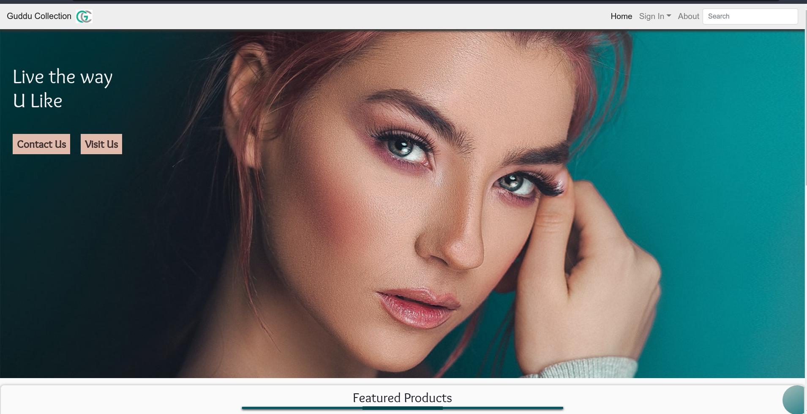
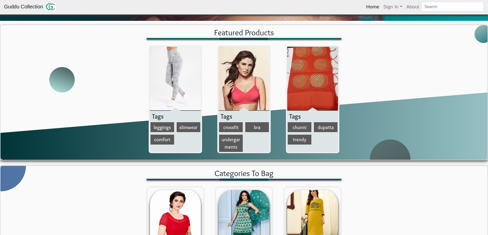
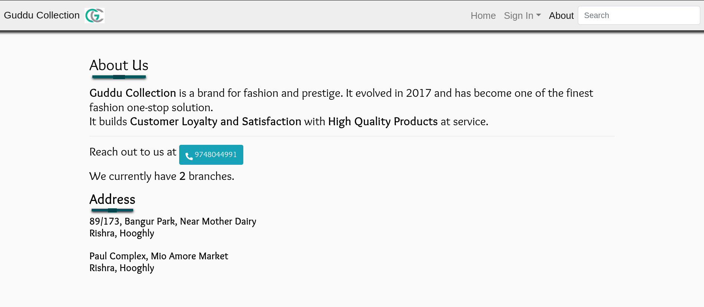

# Guddu Collection

[](./LICENSE.md)

> **A Progressive WebApp for Men and Women Fashion Wear**







Please visit our [Webapp](https://guddu-collection.netlify.app/) and our shops located at:

### Branches in Rishra, Hooghly:

- 89/173, Bangur Park, Near Mother Dairy
- Near Paul Complex, Mio Amore Market

## Run/Build the Project

### Prerequisites

Create a `<project-root>/.env.local` file similar to the `.env.sample` file, and put all the required environment variables in there.

Then, run the below command to install the dependencies:

```sh
npm i
```

### Commands

- `npm start`: Runs a development server on port 3000.
- `npm test`: Launches the test runner in the interactive watch mode.
- `npm run build`: Builds the app for production to the `build` folder.
- `npm run serve`: Serves the `build` folder locally.
- `npm run build:serve`: Runs the `build` command and also serves the `build` folder on port 3000.
